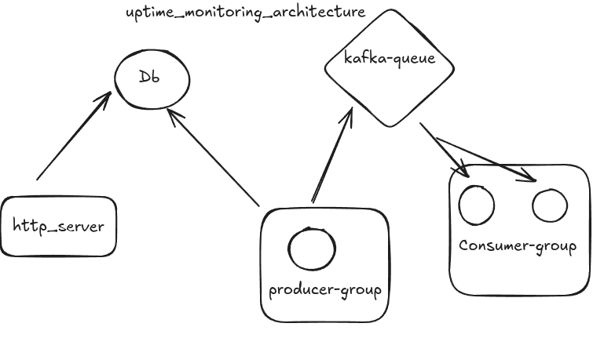

# Uptime Monitoring Service with Discord Notifications

## Table of Contents
- [Overview](#overview)
- [Features](#features)
- [Architecture](#architecture)
- [API Documentation](#api-documentation)
  - [Website Management](#website-management)
  - [Status History](#status-history)
  - [Webhook Management](#webhook-management)
- [Deployment](#deployment)
- [Notification Examples](#notification-examples)
- [Testing](#testing)
- [Design Decisions](#design-decisions)

## Overview <a name="overview"></a>
A scalable uptime monitoring solution that checks website availability using HTTP requests and sends Discord notifications via webhooks. Built with Django, Kafka, and Docker.

## Features <a name="features"></a>
- Real-time website status monitoring
- Customizable check intervals
- Multi-webhook support with failover
- Historical status tracking
- Kafka-based task queue
- Dockerized environment

## Architecture <a name="architecture"></a>

- **Django REST API**: Handles website/webhook CRUD operations
- **Kafka Producers**: Schedule website checks
- **Kafka Consumers**: Process status checks and notifications
- **PostgreSQL**: Persistent data storage

## API Documentation <a name="api-documentation"></a>

### Website Management <a name="website-management"></a>

**1. List/Add Websites**  
`GET/POST /api/v1/sites/`

Request (POST):
```json
{
    "url": "https://example.com",
    "name": "Example Site",
    "expected_status_code": 200,
    "webhooks": [
        "https://discord.com/api/webhooks/your-webhook-1",
        "https://discord.com/api/webhooks/your-webhook-2"
    ]
}
```

Success Response (201):
```json
{
    "success": true,
    "data": {
        "id": "550e8400-e29b-41d4-a716-446655440000",
        "url": "https://example.com",
        "name": "Example Site",
        "expected_status_code": 200,
        "created_at": "2024-01-20T12:00:00Z"
    }
}
```

**2. Delete Website**  
`DELETE /api/v1/sites/{uuid}`

Success Response (204):
```json
{
    "success": true,
    "data": "Website 550e8400-e29b-41d4-a716-446655440000 has been successfully deleted."
}
```

### Status History <a name="status-history"></a>

**3. Get Status History**  
`GET /api/v1/sites/{uuid}/history`

Success Response (200):
```json
{
    "success": true,
    "data": [
        {
            "id": "670e8400-e29b-41d4-a716-446655440000",
            "status": "up",
            "response_time": 152.3,
            "checked_at": "2024-01-20T12:05:00Z"
        },
        {
            "id": "780e8400-e29b-41d4-a716-446655440000",
            "status": "down",
            "response_time": null,
            "checked_at": "2024-01-20T12:10:00Z"
        }
    ]
}
```

### Webhook Management <a name="webhook-management"></a>

**4. List Webhooks**  
`GET /api/v1/webhooks/`

Success Response (200):
```json
{
    "success": true,
    "data": [
        {
            "id": "330e8400-e29b-41d4-a716-446655440000",
            "url": "https://discord.com/api/webhooks/your-webhook-1"
        },
        {
            "id": "440e8400-e29b-41d4-a716-446655440000",
            "url": "https://discord.com/api/webhooks/your-webhook-2"
        }
    ]
}
```

**5. Add Webhook**  
`POST /api/v1/webhooks/`

Request:
```json
{
    "webhook_url": "https://discord.com/api/webhooks/new-webhook"
}
```

Success Response (201):
```json
{
    "success": true,
    "data": "Webhook added and associated with all websites"
}
```

**6. Remove Webhook**  
`DELETE /api/v1/webhooks/`

Request:
```json
{
    "webhook_url": "https://discord.com/api/webhooks/new-webhook"
}
```

Success Response (204):
```json
{
    "success": true,
    "data": "Webhook removed from all websites"
}
```

## Deployment <a name="deployment"></a>

### Environment Variables
Create `.env` file from template:
```bash
cp example.env .env
```
Configure these values:
```ini
DJANGO_SECRET_KEY=your-secret-key
ALLOWED_HOSTS=* 
DEBUG=True
DATABASE_URL=postgres://user:password@db:5432/uptime_db
DISCORD_WEBHOOK_URL=https://discord.com/api/webhooks/...
DJANGO_SETTINGS_MODULE=uptime_monitor.settings
DJANGO_LOGLEVEL=info
```

### Database Setup
```bash
cd backend; python manage.py makemigrations; python manage.py migrate
or
docker-compose exec backend python manage.py migrate
```

### Service Management
```bash
# Start all services
docker-compose up -d

# View logs
docker-compose logs -f
```

## Notification Examples <a name="notification-examples"></a>

**Downtime Alert**
```plaintext
🔴 Website Down Alert
Site: Example Site (https://example.com)
Status: Down
Time: 2024-01-20 12:15:00 UTC
```

**Recovery Notification**
```plaintext
🟢 Website Recovery Alert
Site: Example Site (https://example.com)
Status: UP
Time: 2024-01-20 12:20:00 UTC
```

## Testing <a name="testing"></a>

Run test suite:
```bash
docker-compose exec backend pytest -v
```

Test scenarios include:
- Website status detection
- Webhook association logic
- Kafka message serialization
- Failure recovery mechanisms
- Notification content validation

## Design Decisions <a name="design-decisions"></a>

1. **UUID Primary Keys**
   - Avoids sequential IDs for security
   - Enables easy horizontal scaling

2. **Multi-Webhook Support**
   - Websites can have multiple notification channels
   - Fallback to default webhook if none specified

3. **Kafka Consumer Groups**
   - Enables parallel processing of checks
   - Automatic load balancing between consumers

4. **Status Change Detection**
   - Only trigger notifications on state transitions
   - Stores previous state in StatusLog model

5. **Optimized Docker Builds**
   - Separate build and runtime images
   - Cached dependency installation
   - Minimal final image size (~150MB)


